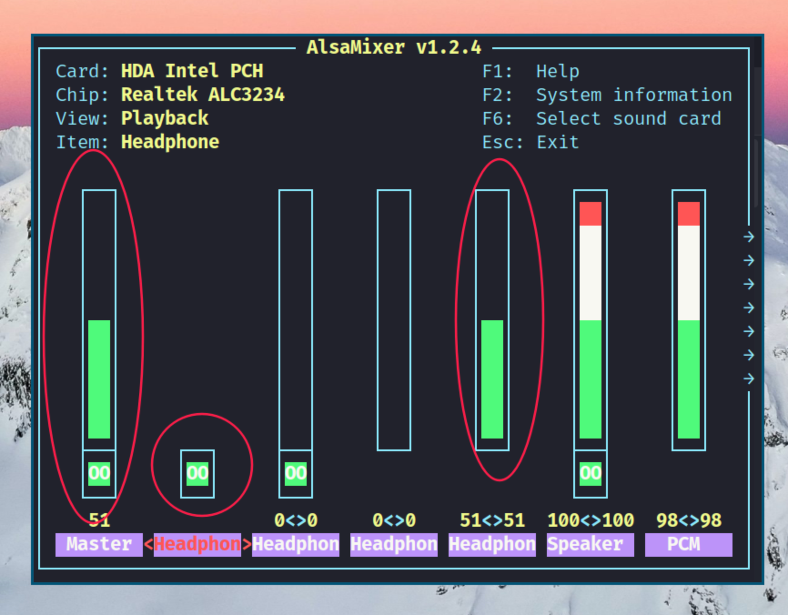

# Home

> Ref: <https://github.com/johnalanwoods/maintained-modern-unix>

## 1. My projects

| URL                                       | Platform          |
| ----------------------------------------- | ----------------- |
| <https://github.com/ysl2/blog>            | Linux/Mac/Windows |
| <https://github.com/ysl2/dotfiles>        | Linux/Mac/Windows |
| <https://github.com/ysl2/alacritty-sixel> | Linux/Mac/Windows |
| <https://github.com/ysl2/lazyvim>         | Linux/Mac         |
| <https://github.com/ysl2/dotlinks>        | Mac/Windows       |
| <https://github.com/ysl2/i3>              | Linux             |

## 2. Common platform tools

### 2.1 Basic tools

| Name       | Platform          | Type | Note                | URL                                      |
| ---------- | ----------------- | ---- | ------------------- | ---------------------------------------- |
| `bottom`   | Linux/Mac/Windows | TUI  | Check system status | <https://github.com/ClementTsang/bottom> |
| `snipaste` | Linux/Mac/Windows | GUI  | Image capture       | <https://www.snipaste.com>               |
| `ncdu`     | Linux/Mac         | TUI  | Check disk usage    | <https://man.archlinux.org/man/ncdu.1>   |

- [`redshift`](https://github.com/jonls/redshift) (Linux/Mac/Windows, CLI, Brightness)

  ```bash
  # install
  sudo apt install redshift
  # Set to default night mode colur
  redshift -P -O 4500K
  # Reset
  redshift -x
  ```

### 2.2 Other tools

| Name                | Platform          | Type    | Note                                | URL                                                                      |
| ------------------- | ----------------- | ------- | ----------------------------------- | ------------------------------------------------------------------------ |
| `termscp`           | Linux/Mac/Windows | TUI     | SFTP in terminal                    | <https://github.com/veeso/termscp>                                       |
| `flameshot`         | Linux/Mac/Windows | GUI     | Image capture                       | <https://github.com/flameshot-org/flameshot>                             |
| `pdf2svg`           | Linux/Mac/Windows | CLI     | PDF to SVG, for Typst               | <https://github.com/dawbarton/pdf2svg>                                   |
| `qrcp`              | Linux/Mac/Windows | CLI     | File transfer                       | <https://github.com/claudiodangelis/qrcp>                                |
| `glow`              | Linux/Mac/Windows | TUI     | Markdown previewer                  | <https://github.com/charmbracelet/glow>                                  |
| `obs`               | Linux/Mac/Windows | GUI     | Live streaming and screen recording | <https://github.com/obsproject/obs-studio>                               |
| `eslockdec`         | Linux/Mac/Windows | GUI     | Unlock eslock file                  | <https://github.com/Rambin/eslockdec>                                    |
| `BaiduPCS-Go`       | Linux/Mac/Windows | CLI     | Baidunetdisk CLI                    | <https://github.com/qjfoidnh/BaiduPCS-Go>                                |
| `sing-box`          | Linux/Mac/Windows | CLI/GUI | V.P.N                               | <https://github.com/SagerNet/sing-box>                                   |
| `nvtop` or `nvitop` | Linux/Mac/Windows | TUI     | Check GPU status in terminal        | <https://github.com/Syllo/nvtop> / <https://github.com/XuehaiPan/nvitop> |
| `carbonyl`          | Linux/Mac         | TUI     | Browser in terminal                 | <https://github.com/fathyb/carbonyl>                                     |
| `trans`             | Linux/Mac         | CLI     | Language translate                  | <https://github.com/soimort/translate-shell>                             |
| `chafa`             | Linux/Mac         | CLI     | Terminal image renderer             | <https://github.com/hpjansson/chafa>                                     |
| `gh`                | Linux/Mac         | CLI     | Official Github CLI                 | <https://github.com/cli/cli>                                             |
| `gh-dash`           | Linux/Mac         | TUI     | Github dashboard                    | <https://github.com/dlvhdr/gh-dash>                                      |
| `mycli`             | Linux/Mac         | CLI     | MySQL                               | <https://github.com/dbcli/mycli>                                         |
| `ilovepdf`          | Web               |         | PDF process                         | <https://www.ilovepdf.com/>                                              |
| `iloveimg`          | Web               |         | Image process                       | <https://www.iloveimg.com/>                                              |

- [`img2pdf`](https://github.com/josch/img2pdf) (Linux/Mac/Windows, CLI, Image to PDF, for Latex)

  ```bash
  pip install img2pdf

  img2pdf *.jpg -o output.pdf
  ```

| Scene: Video download  | Platform          | Type | Note                       | URL                                                |
| ---------------------- | ----------------- | ---- | -------------------------- | -------------------------------------------------- |
| `res-downloader`       | Linux/Mac/Windows | CLI  | WeChat, XHS, etc. download | <https://github.com/putyy/res-downloader>          |
| `m3u8-downloader`      | Linux/Mac/Windows | CLI  | M3U8 video downloader      | <https://github.com/ysl2/m3u8-downloader>          |
| `wx_channels_download` | Mac/Windows       | CLI  | WeChat channels download   | <https://github.com/ltaoo/wx_channels_download>    |
| `m3u8-downloader`      | Web               |      | M3U8 video downloader      | <https://github.com/Momo707577045/m3u8-downloader> |

- [`yt-dlp`](https://github.com/yt-dlp/yt-dlp) (Linux/Mac/Windows, CLI, Video downloader)

  ```bash
  # For linux or mac
  ./yt-dlp "https://my.url" -o "01.mp4"

  # For windows
  .\yt-dlp.exe --no-check-certificate "https://my.url" -o "01.mp4"
  ```

## 3. Linux specific tools

### 3.1 Basic tools

| Name           | Platform | Type | Note                  | URL                                          |
| -------------- | -------- | ---- | --------------------- | -------------------------------------------- |
| `nmtui`        | Linux    | TUI  | Network               | <https://man.archlinux.org/man/nmtui.1>      |
| `bluetuith`    | Linux    | TUI  | Bluetooth             | <https://github.com/bluetuith-org/bluetuith> |
| `xrandr`       | Linux    | CLI  | Monitor control       | <https://man.archlinux.org/man/xrandr.1>     |
| `arandr`       | Linux    | GUI  | Monitor control       | <https://github.com/haad/arandr>             |
| `feh`          | Linux    | TUI  | For desktop wallpaper | <https://github.com/derf/feh>                |
| `picom`        | Linux    | TUI  | Window transparent    | <https://github.com/yshui/picom>             |
| `dunst`        | Linux    | CLI  | Show notification     | <https://github.com/dunst-project/dunst>     |
| `udiskie`      | Linux    | GUI  | USB mount             | <https://github.com/coldfix/udiskie>         |
| `tlp`          | Linux    | CLI  | Power saver           | <https://github.com/linrunner/TLP>           |
| `lxappearance` | Linux    | GUI  | GTK theme changer     | <https://github.com/lxde/lxappearance>       |

- [`brightnessctl`](https://github.com/Hummer12007/brightnessctl) (Linux, CLI, Brightness)

  ```bash
  #  Increase by 3%
  brightnessctl set 3%+

  # decrease by 3%
  brightnessctl set 3%-
  ```

- [`alsamixer`](alsa-project.org) (Linux, TUI, Sound)

  For headphone settings:

  

  Or amixer

  ```bash
  amixer -M get Master
  amixer -M set Master 0%
  amixer -M set Master 5%+
  ```

### 3.2 Other tools

| Name           | Platform | Type | Note                             | URL                                                 |
| -------------- | -------- | ---- | -------------------------------- | --------------------------------------------------- |
| `wechat`       | Linux    | GUI  | WeChat (with unofficial flatpak) | <https://github.com/web1n/wechat-universal-flatpak> |
| `qq`           | Linux    | GUI  | Official QQ                      | <https://im.qq.com/linuxqq/index.shtml>             |
| `color-picker` | Linux    | GUI  | Color picker                     | <https://github.com/keshavbhatt/ColorPicker>        |

- [`bluetoothctl`](https://man.archlinux.org/man/bluetoothctl.1) (Linux, CLI, Bluetooth)

  ```text
  要使用 bluetoothctl 连接蓝牙设备，您可以按照以下步骤进行操作：

  打开终端并输入 bluetoothctl 进入蓝牙控制台。

  输入 power on，确保蓝牙适配器已经开启。

  输入 agent on，启用默认的蓝牙代理。

  输入 scan on，开始扫描周围的蓝牙设备。等待一段时间，直到您看到要连接的设备的 MAC 地址。

  输入 pair <device MAC>，将 <device MAC> 替换为您要连接的设备的 MAC 地址。这将发起配对过程。

  如果需要输入配对码，按照提示进行操作。配对码通常会在蓝牙设备上显示或者在设备的用户手册中提供。

  输入 trust <device MAC>，将设备标记为受信任的设备，以便将来自动连接。

  输入 connect <device MAC>，将 <device MAC> 替换为您要连接的设备的 MAC 地址。这将尝试建立与设备的连接。

  如果连接成功，您应该会在终端中看到一条消息确认连接成功。

  请注意，上述步骤中的 <device MAC> 是要连接的蓝牙设备的 MAC 地址。您可以在扫描步骤中获取它。此外，根据设备的类型和要求，可能还需要进行其他步骤。如果您遇到任何问题，请参考蓝牙设备的用户手册或官方文档，以获取更详细的指导。
  ```

## 4. Scene: Thesis and notes tools

| Category  | Name                                                 | Read papers     | Write papers    | Presentation (PPT) | Notes (Word)    | Databases (Excel) |
| --------- | ---------------------------------------------------- | --------------- | --------------- | ------------------ | --------------- | ----------------- |
| `Storage` | [`git`](https://git-scm.com/)                        | Y               | Y               | Y                  | Y               | Y                 |
| `Storage` | [`nutstore`](https://www.jianguoyun.com/)            | Y               |                 | Y                  |                 | Y                 |
| `Storage` | [`baidunetdisk`](https://pan.baidu.com/)             | Y               |                 | Y                  |                 | Y                 |
| `IDE`     | [`zotero`](https://www.zotero.org/)                  | Y               |                 |                    |                 |                   |
| `IDE`     | [`lazyvim`](https://www.lazyvim.org/)                |                 | Opt.1 (offline) | Y (latex table)    | Opt.1 (offline) |                   |
| `IDE`     | [`overleaf`](http://overleaf.com/)                   |                 | Opt.2 (online)  |                    |                 |                   |
| `IDE`     | [`obsidian`](https://obsidian.md/)                   |                 |                 |                    | Opt.2 (offline) | Opt.1 (offline)   |
| `IDE`     | [`mubu`](https://mubu.com/)                          | Y (mindmap)     |                 | Y (mindmap)        | Opt.3 (online)  |                   |
| `IDE`     | [`notion`](https://www.notion.so/)                   | Y (database)    |                 |                    | Opt.4 (online)  | Opt.2 (online)    |
| `IDE`     | [`wps`](https://www.wps.cn/)                         |                 |                 | Opt.1 (offline)    | Opt.5 (offline) | Opt.3 (offline)   |
| `IDE`     | [`tencent-doc`](https://docs.qq.com/)                |                 |                 | Opt.2 (online)     | Opt.6 (online)  | Opt.4 (online)    |
| `IDE`     | [`typora`](https://typora.io/)                       | Y (excel to md) |                 |                    |                 |                   |
| `IDE`     | [`typst`](https://typst.app/)                        |                 | Opt.3 (offline) |                    |                 |                   |
| `Tool`    | [`drawio`](https://draw.io/)                         |                 | Y               | Y                  |                 |                   |
| `Tool`    | [`mermaidchart`](https://mermaidchart.com)           |                 |                 | Y                  |                 |                   |
| `Tool`    | [`tablesgenerator`](https://www.tablesgenerator.com) |                 | Y               | Y                  |                 |                   |
| `Tool`    | [`tldraw`](https://www.tldraw.com/)                  | Y               |                 | Y                  |                 |                   |
| `Tool`    | [`marp`](https://marp.app/)                          |                 |                 | Opt.3 (offline)    |                 |                   |
