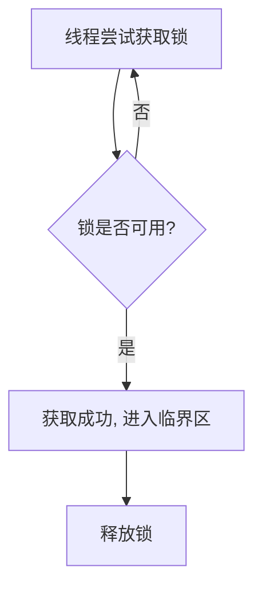
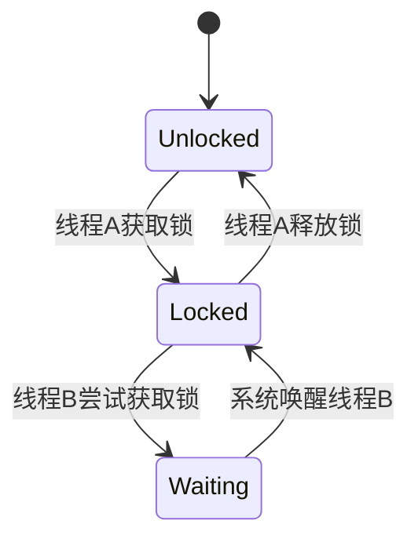
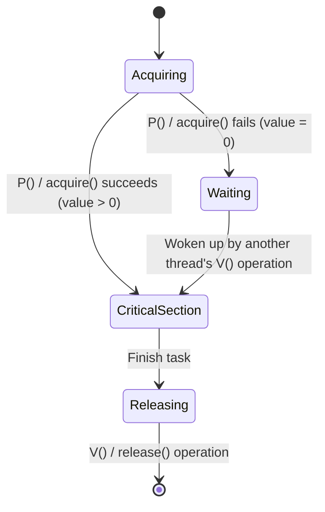
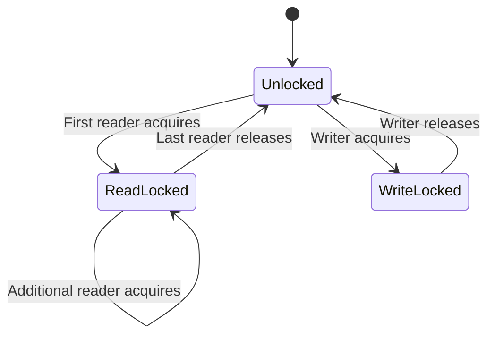
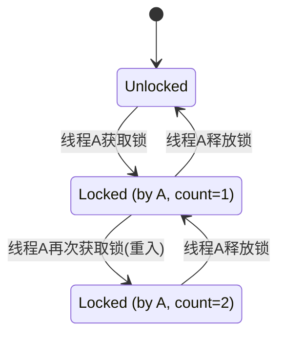
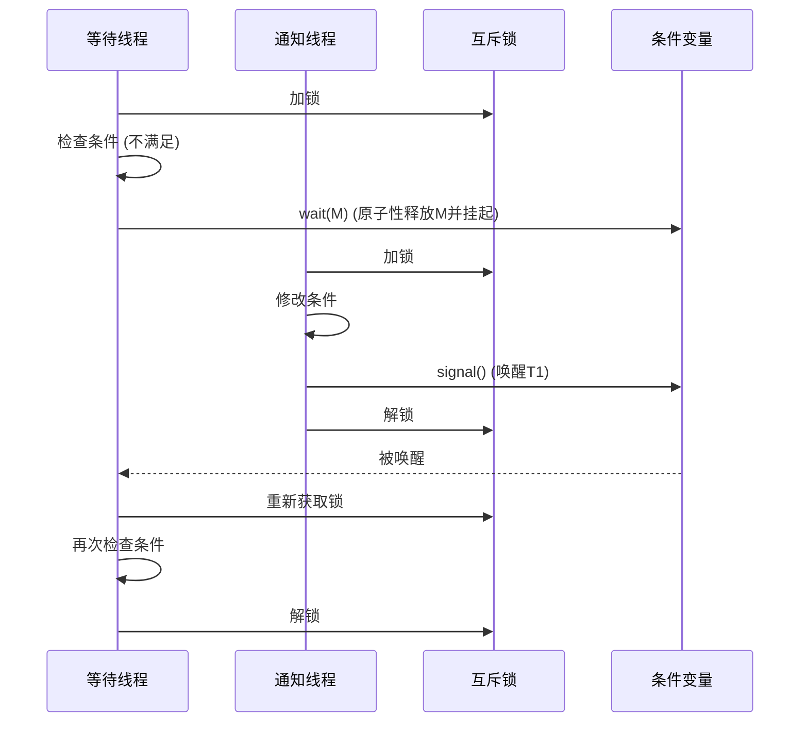

# [study-os] 操作系统中的锁机制详解

锁是多线程编程中的核心同步机制，用于防止因多个线程并发访问共享资源而引发的竞态条件。本文将介绍几种关键的锁机制，并分析其工作原理与适用场景。

## 锁机制类型概览

1. **自旋锁 (Spin Lock)**
2. **互斥锁 (Mutex)**
3. **信号量 (Semaphore)**
4. **读写锁 (Read-Write Lock)**
5. **递归锁 (Recursive Lock)**
6. **条件变量 (Condition Variable)**

---

## 1. 自旋锁 (Spin Lock)

**类比：** 如同一个人想进一个房间，他不去排队，而是在门口不停地尝试转动门把手，直到门锁被打开。这个“不停尝试”的过程就是“自旋”。

当线程尝试获取一个已被持有的自旋锁时，该线程不会被挂起（进入睡眠状态），而是在一个循环中持续检查锁是否被释放。这种方式避免了线程上下文切换的开销。

### 工作流程图

### 优缺点及解决方案

| 优点                                                                         | 缺点                                                                                 | 此锁的适用场景及举例                                                                                                                                          | 现代解决方案                                                         |
| :--------------------------------------------------------------------------- | :----------------------------------------------------------------------------------- | :------------------------------------------------------------------------------------------------------------------------------------------------------------ | :------------------------------------------------------------------- |
| **响应极快**：如果锁的持有时间非常短，自旋等待比线程休眠和唤醒的成本低得多。 | **消耗CPU**：如果锁持有时间长，自旋会持续占用CPU，造成资源浪费。                     | **场景**: 锁的持有时间极短，且CPU资源充足的多核环境。 **举例**: 内核中对某个计数器进行加一操作，这个操作耗时极短，使用自旋锁可以避免上下文切换的巨大开销。 | **自适应自旋锁**：自旋一定次数后，如果仍未获取到锁，就转为阻塞状态。 |
| **无上下文切换**：避免了操作系统内核进行线程调度的开销。                     | **不适用于单核CPU**：在单核CPU上，自旋线程会阻止持有锁的线程运行，导致锁无法被释放。 |                                                                                                                                                               | **硬件原子指令**：利用CPU提供的`test-and-set`等原子指令高效实现。    |

---

## 2. 互斥锁 (Mutex)

**类比：** 如同只有一个钥匙的房间，一人持有钥匙进入后，其他人必须排队等待其归还钥匙才能进入。

互斥锁（Mutex）确保同一时间只有一个线程能进入临界区。尝试获取已被持有锁的线程将被阻塞，直到锁被释放。

### 工作流程图

### 优缺点及解决方案

| 优点                  | 缺点                                               | 此锁的适用场景及举例                                                                                                                                                                  | 现代解决方案                                     |
| :-------------------- | :------------------------------------------------- | :------------------------------------------------------------------------------------------------------------------------------------------------------------------------------------ | :----------------------------------------------- |
| 实现简单，开销小。    | **死锁**：多线程互相等待对方的锁。                 | **场景**: 保护一段临界区代码，确保其在任何时候只有一个线程执行，这是最通用的锁。 **举例**: 对一个共享的全局变量（如配置信息）进行修改，或者向一个共享的链表执行插入/删除节点操作。 | **锁序法**：按固定顺序获取锁；**死锁检测**机制。 |
| 操作原子，不消耗CPU。 | **优先级反转**：低优先级线程持锁阻塞高优先级线程。 |                                                                                                                                                                                       | **优先级继承**：临时提升持锁线程的优先级。       |

---

## 3. 信号量 (Semaphore)

**类比：** 如同一个有N个车位的停车场，每辆车进入，车位数减一；车离开，车位数加一。车位满时，新车必须等待。

信号量（Semaphore）是一个计数器，允许多个线程并发访问资源，但会限制其最大数量。值为1时等同于互斥锁。

### 工作流程图

### 优缺点及解决方案

| 优点                               | 缺点                       | 此锁的适用场景及举例                                                                                                                                                 | 现代解决方案                                                 |
| :--------------------------------- | :------------------------- | :------------------------------------------------------------------------------------------------------------------------------------------------------------------- | :----------------------------------------------------------- |
| 控制多个资源的并发访问，高度灵活。 | 编程比互斥锁复杂，易出错。 | **场景**: 控制对一组有限资源的并发访问。 **举例**: 实现一个数据库连接池，池中只有10个连接，信号量初始值为10，每个线程需要获取一个信号量才能拿到连接，用完后释放。 | **高级抽象**：现代语言提供封装好的库（如Java `Semaphore`）。 |
| 可用于复杂的线程同步。             | 同样存在**死锁**风险。     |                                                                                                                                                                      | 依赖**良好的编程规范**和**死锁检测**。                       |

---

## 4. 读写锁 (Read-Write Lock)

**类比：** 如同一个展览，允许多人同时参观（读），但当需要更换展品（写）时，必须清场，不允许任何人进入。

读写锁（Read-Write Lock）针对“读多写少”场景优化。它允许多个线程同时读（共享锁），但写操作（排他锁）是互斥的，且与读锁不共存。

### 工作流程图

### 优缺点及解决方案

| 优点                       | 缺点                                                 | 此锁的适用场景及举例                                                                                                                                                                 | 现代解决方案                                                |
| :------------------------- | :--------------------------------------------------- | :----------------------------------------------------------------------------------------------------------------------------------------------------------------------------------- | :---------------------------------------------------------- |
| “读多写少”场景下并发性高。 | **“写者饥饿”**：写请求可能因连续的读请求而长期等待。 | **场景**: “读多写少”的应用，即读操作的频率远高于写操作。 **举例**: 一个用户系统的配置数据，大多数时候是读取配置，偶尔才会有管理员去修改它。此时读操作可以并发进行，大大提高性能。 | **公平/写优先策略**：实现更复杂的锁策略，保证写者不会饿死。 |
| 逻辑清晰，区分读写。       | 实现复杂，开销大于互斥锁。                           |                                                                                                                                                                                      | 操作系统和语言库提供**优化过的内置实现**。                  |

---

## 5. 递归锁 (Recursive Lock)

**类比：** 如同可重复进入的房间，同一线程在持有锁后，可以再次进入而不会被自己锁住。

递归锁（Recursive Lock）允许同一线程多次获取同一个锁而不会死锁。锁内部维护计数器，只有当所有获取和释放操作配对后，锁才真正被释放给其他线程。

### 工作流程图

### 优缺点及解决方案

| 优点                             | 缺点                                                             | 此锁的适用场景及举例                                                                                                                                                                                | 现代解决方案                                             |
| :------------------------------- | :--------------------------------------------------------------- | :-------------------------------------------------------------------------------------------------------------------------------------------------------------------------------------------------- | :------------------------------------------------------- |
| 防止在递归或重入调用中产生死锁。 | **可能隐藏设计缺陷**：过度依赖递归锁可能意味着代码结构需要优化。 | **场景**: 一个函数在持有锁的情况下，需要递归调用自身，或者调用其他同样需要此锁的函数。 **举例**: 一个对象的方法`A`获取了锁，然后它内部调用了同一个对象的另一个方法`B`，而`B`也需要获取同一个锁。 | **代码重构**：优化代码设计，避免在持有锁时进行重入调用。 |
| 使用直观。                       | 性能开销略高于非递归锁。                                         |                                                                                                                                                                                                     | **谨慎使用**，仅用于必要场景。                           |

---

## 6. 条件变量 (Condition Variable)

**类比：** 如同餐厅等位，获取锁（排上队）后发现没座位（条件不满足），于是调用`wait`释放锁并去等候区。当有空位时，服务员通过`signal`通知，你被唤醒后重新获取锁检查座位。

条件变量（Condition Variable）与互斥锁配合使用，用于线程间的等待和通知。当条件不满足时，线程可以原子性地释放锁并进入等待状态，避免忙等待。

### 工作流程图

### 优缺点及解决方案

| 优点                            | 缺点                             | 此锁的适用场景及举例                                                                                                                                                                                                                                 | 现代解决方案                                              |
| :------------------------------ | :------------------------------- | :--------------------------------------------------------------------------------------------------------------------------------------------------------------------------------------------------------------------------------------------------- | :-------------------------------------------------------- |
| 避免忙等待，节约CPU资源。       | **使用复杂**，易用错。           | **场景**: 需要实现“等待-通知”机制，一个或多个线程等待某个条件达成，由另一个线程来通知它们。 **举例**: 实现一个“生产者-消费者”模型。当队列为空时，消费者线程等待（wait）条件变量；当生产者向队列中添加了物品后，通知（signal）消费者可以继续工作。 | **遵循标准模式**：使用`while`循环检查条件，处理“伪唤醒”。 |
| 可实现复杂的生产者-消费者模型。 | **伪唤醒**：线程可能被意外唤醒。 |                                                                                                                                                                                                                                                      | 现代语言库提供健壮实现，但仍需开发者遵循正确模式。        |

## 总结

为特定并发场景选择合适的锁至关重要。总结如下：

- **自旋锁**：适用于锁持有时间极短的场景，可避免上下文切换开销。
- **互斥锁**：最通用的互斥工具，线程会睡眠等待，不消耗CPU。
- **信号量**：控制对一组有限资源的并发访问数。
- **读写锁**：优化“读多写少”场景的性能。
- **递归锁**：用于递归函数中的加锁，防止同一线程死锁。
- **条件变量**：与互斥锁配合，实现复杂的等待/通知同步模式。

理解并正确使用这些机制是编写高效、安全并发程序的关键。

---

## 各类锁机制横向对比

下表对核心的锁机制进行了横向对比，以帮助快速选择。

| 特性         | 自旋锁 (Spin Lock)       | 互斥锁 (Mutex)         | 信号量 (Semaphore)   | 读写锁 (Read-Write Lock) |
| :----------- | :----------------------- | :--------------------- | :------------------- | :----------------------- |
| **核心作用** | 极短时间的互斥           | 通用互斥               | 控制并发资源数量     | 读写分离，提升读并发     |
| **等待方式** | 忙等待 (Busy-Waiting)    | 睡眠等待 (Blocking)    | 睡眠等待 (Blocking)  | 睡眠等待 (Blocking)      |
| **资源占用** | 消耗CPU                  | 不消耗CPU              | 不消耗CPU            | 不消耗CPU                |
| **适用场景** | 锁持有时间极短，多核环境 | 通用临界区保护         | 资源池、线程池等     | 读多写少的应用           |
| **主要优点** | 响应快，无上下文切换     | 简单易用，不占CPU      | 灵活，可允许多个线程 | 读并发性能高             |
| **主要缺点** | 消耗CPU，单核无效        | 性能不如自旋锁（短时） | 编程复杂，易出错     | 可能导致“写者饥饿”       |

**注：** 递归锁是互斥锁的一种变体，解决了重入问题。条件变量是与锁配合的同步原语，用于等待/通知，而非直接的锁机制，故未包含在此对比表中。

