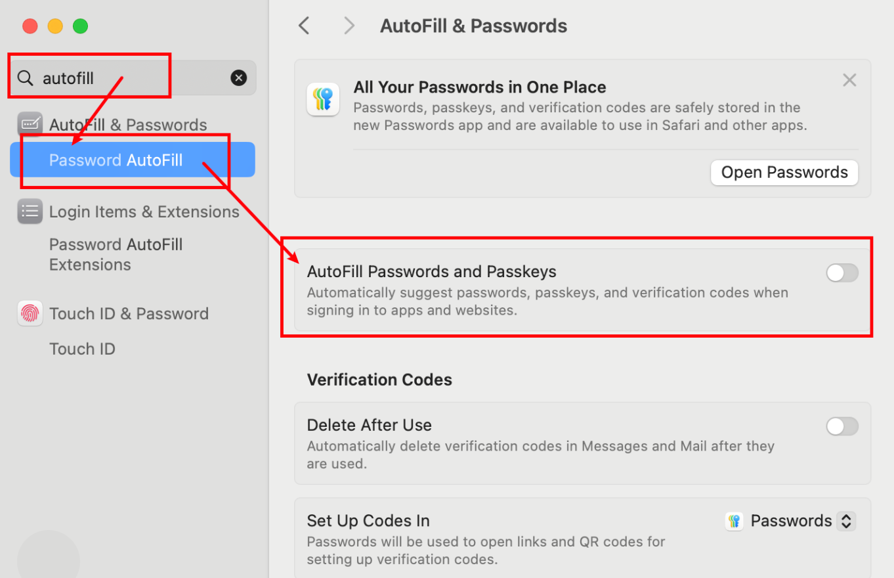
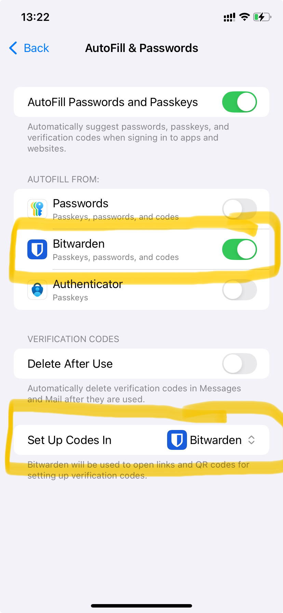

# bitwarden

## Disable browser's built-in password manager

1. Follow the official manual: <https://bitwarden.com/help/disable-browser-autofill>

1. For macOS specific, disable OS's autofill:

   

## Use bitwarden in iphone

