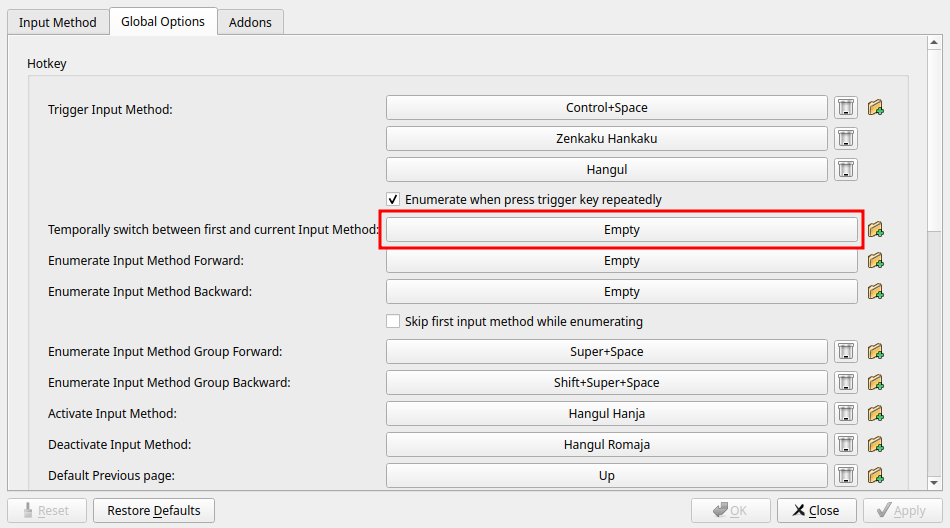
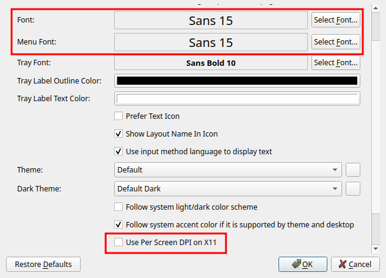

# fcitx5

1. Install dependencies and reboot computer.

   ```bash
   sudo apt-get install fcitx5 fcitx5-chinese-addons
   ```

1. Add Pinin into fcitx-configuration

    

1. Set keymap (Use `<C-space>` to switch input method).

    <p></p>

1. Set menu font size to 15，and scroll down in this page, turn off option `Use Per Screen DPI on X11`.

   

   <p></p>
