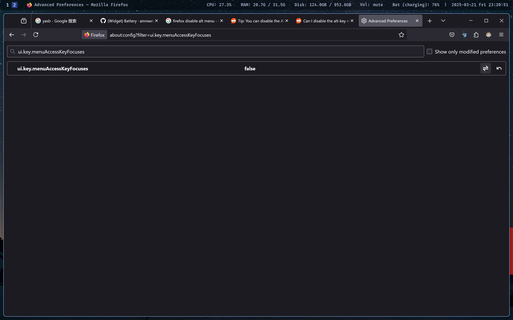

# firefox

## Disable `alt` key

> Ref: <https://www.reddit.com/r/firefox/comments/6451y1/can_i_disable_the_altkey_menu_bar_showing_behavior/>

`about:config`

`ui.key.menuAccessKeyFocuses`

<p></p>

## Uninstall firefox snap on ubuntu and install from mozilla ppa

1. Remove Firefox Snap

   ```bash
   sudo apt remove firefox
   ```

1. Prevent Firefox from being reinstalled as a snap package

   ```bash
   echo 'Unattended-Upgrade::Allowed-Origins:: "LP-PPA-mozillateam:${distro_codename}";' | sudo tee /etc/apt/apt.conf.d/51unattended-upgrades-firefox
   sudo vim /etc/apt/preferences.d/mozillateamppa
   ```

   Write the following content into the file:

   ```text
   Package: firefox*
   Pin: release o=LP-PPA-mozillateam
   Pin-Priority: 1001

   Package: firefox*
   Pin: release o=Ubuntu
   Pin-Priority: -1
   ```

1. Add Mozilla PPA and install Firefox

   ```bash
   sudo add-apt-repository ppa:mozillateam/ppa
   sudo apt update
   sudo apt install firefox
   ```
