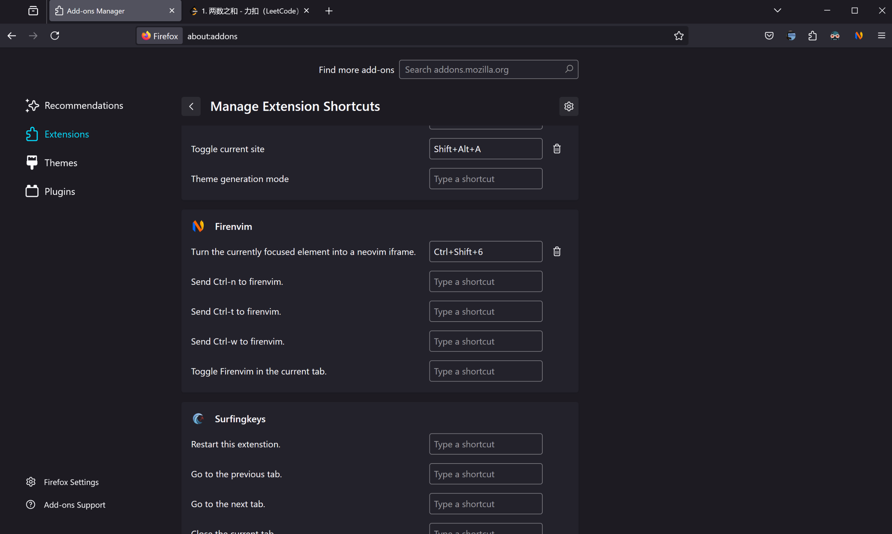
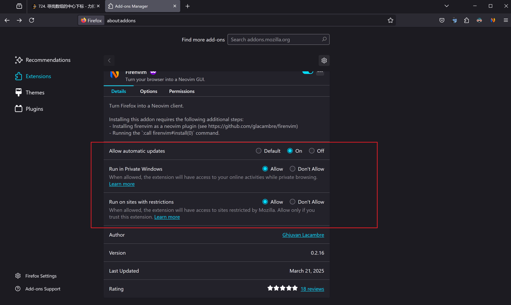

# [lazyvim] Home

## Installation

### Common

```bash
git clone git@github.com/ysl2/lazyvim.git ~/.config/nvim

sudo apt install -y xsel  # For clipboard support
brew install rustup; rustup toolchain install nightly  # For blink.cmp
brew install pngpaste  # For img-clip.nvim

`custom = true`: This means that the plugin is added by myself.
```

### For windows specific

```bash
git clone git@github.com:ysl2/starter.git 'C:\Users\Songli Yu\AppData\Local\nvim'
```

## firenvim

For firefox, `ctrl + shift + 6`:





## vimtex

```bash
# For zathura in vimtex
# Ref: https://github.com/zegervdv/homebrew-zathura?tab=readme-ov-file#osx_native_integration
brew install girara --HEAD
brew install zathura --HEAD
mkdir -p $(brew --prefix zathura)/lib/zathura
ln -s $(brew --prefix zathura-pdf-poppler)/libpdf-poppler.dylib $(brew --prefix zathura)/lib/zathura/libpdf-poppler.dylib
```

### xelatex

The default latex compiler is latexmk, the default compile engine is pdflatex.

If you want to use `xelatex` (for Chinese support) as compile engine in specific project, you should add a `.latexmkrc` in your project root, then add this into this `.latexmkrc`:

```lua
$pdf_mode = 5;
```

This tells latexmk to use `xelatex` as this project's compile engine. the mode 5 represents xelatex. Check vimtex's help doc for more info.
