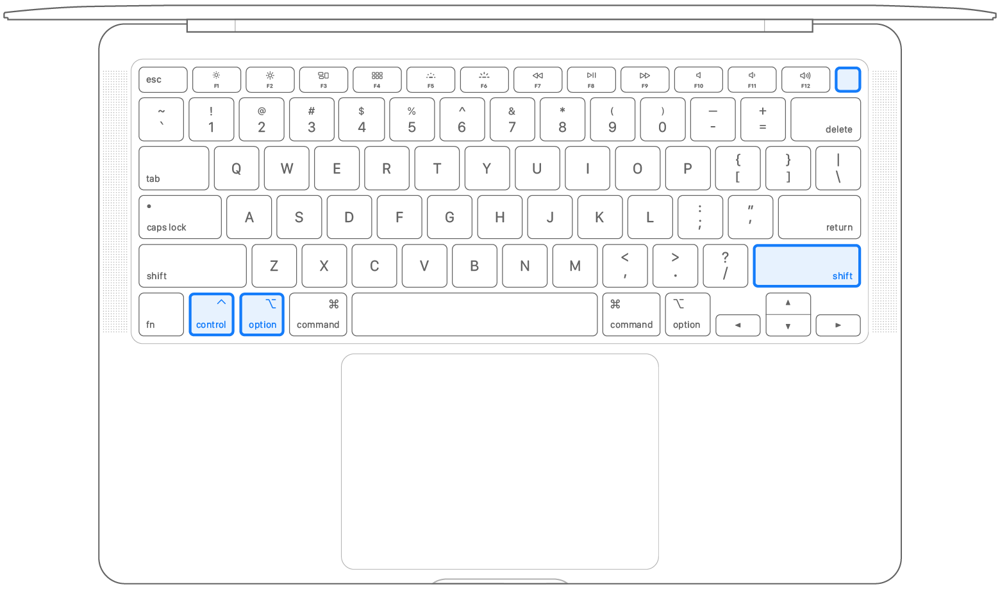

# Mac reset smc

> Ref: <https://support.apple.com/en-us/102605>

1. Shut down your Mac.

1. Keep Press these keys for 7 seconds, then release all keys and the power button at the same time. (Mac might turn on now)

1. Keep press another 7 seconds, then release all keys and the power button at the same time.

