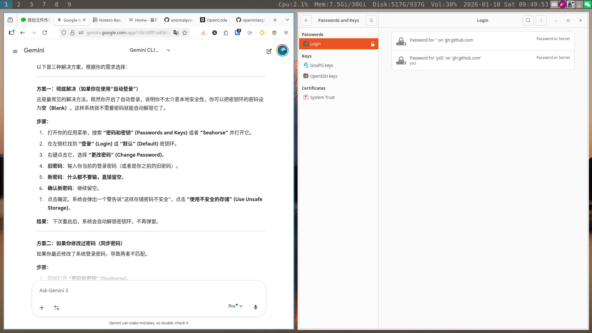

# seahorse

## vscode 解决二次登录问题

> 参考[这里](https://github.com/microsoft/vscode/issues/92972#issuecomment-608572519)，注意 keyring 一定要设置为空（就是什么都不输入）
>
> 如果一不小心输了密码，后面每次登录都要输入密码
>
> 解决这个问题的方法：直接删除 keyring 然后重新上面的操作
>
> keyring 的位置：`~/.local/share/keyrings/`

1. 安装 seahorse

2. 确保`~/.local/share/keyrings/`路径存在，并且文件夹是空的。

3. 打开 seahorse，点左上角的`+`，创建一个新的`Password keyring`，命名为`Login`，然后密码什么都不填直接 continue.

4. vscode 登陆帐号

5. reboot
