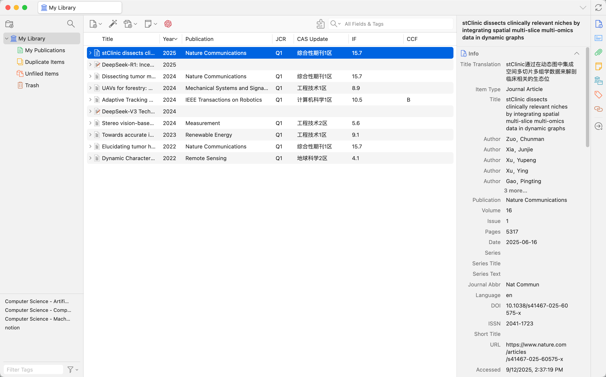
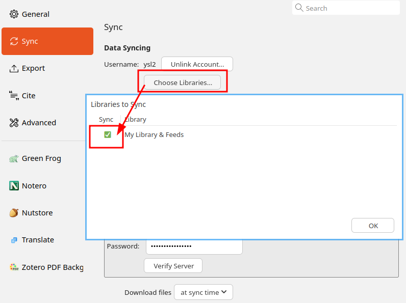
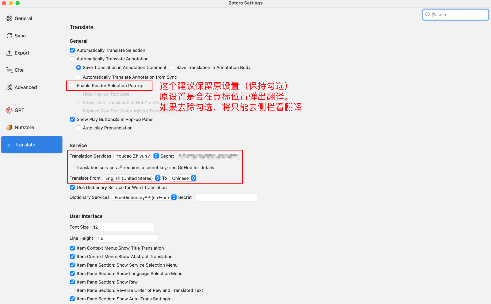
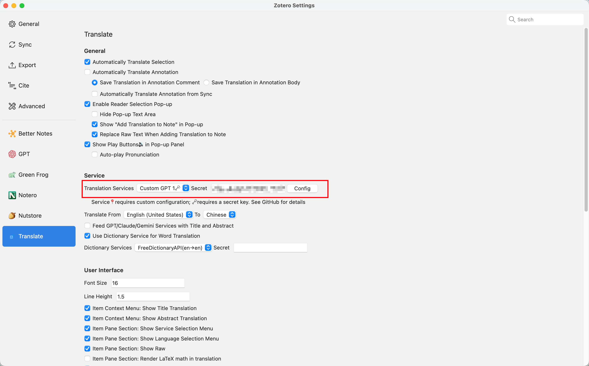
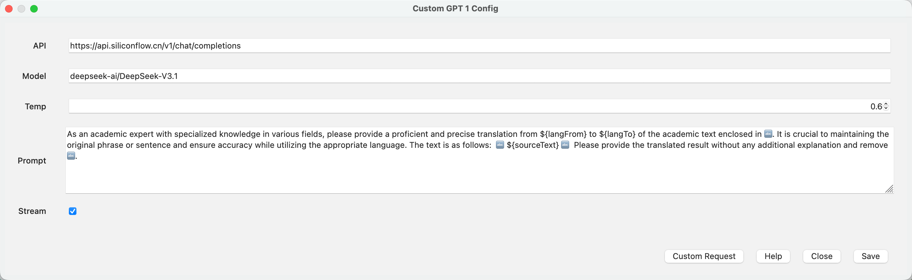
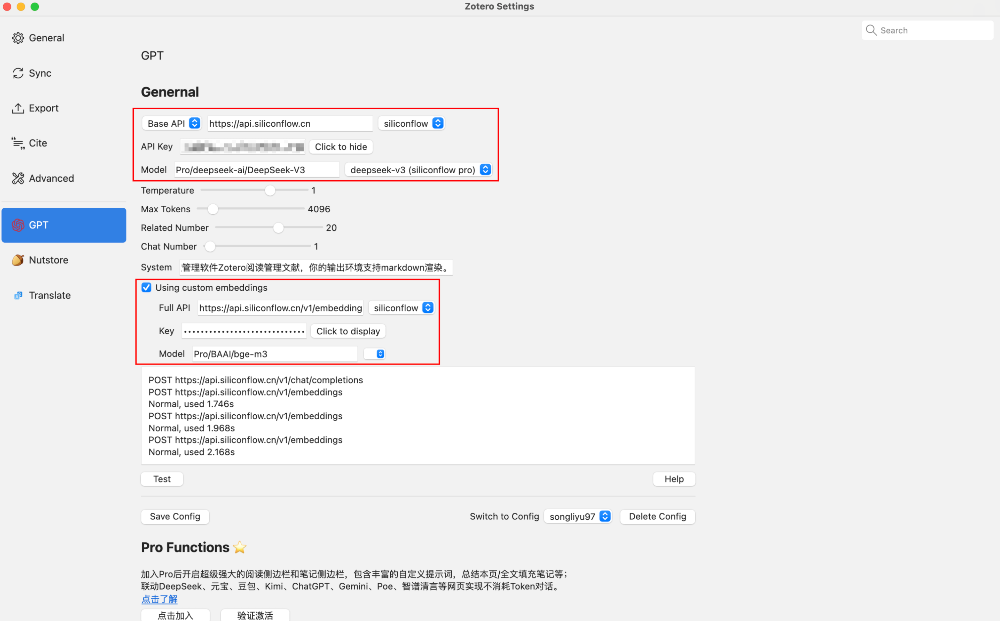
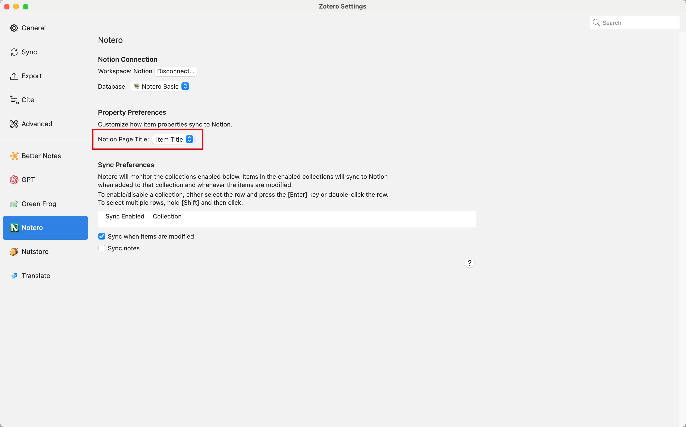

# zotero

| URL                                                  | Description                                                                                                               |
| ---------------------------------------------------- | ------------------------------------------------------------------------------------------------------------------------- |
| <https://github.com/syt2/zotero-addons>              | Zotero Add-on Market \| Zotero插件市场 \| Browsing, installing, and reviewing plugins within Zotero                       |
| <https://github.com/nutstore/zotero-plugin-nutstore> | Nutstore sso plugin for Zotero                                                                                            |
| <https://github.com/windingwind/zotero-better-notes> | Everything about note management. All in Zotero.                                                                          |
| <https://github.com/redleafnew/zotero-updateifsE>    | Green Frog <https://github.com/redleafnew/zotero-updateifs> 的easyScholar数据版。更新影响因子，其他一系列工具，详见Readme |
| <https://github.com/q77190858/zotero-pdf-background> | a zotero plugin of changing pdf background color to care your eyes                                                        |

## [zotero-pdf-translate](https://github.com/windingwind/zotero-pdf-translate)

> Ref: <https://github.com/windingwind/zotero-pdf-translate?tab=readme-ov-file#service>

| Engine                    | Translation                                                                   | Note                                                                                                                             |
| ------------------------- | ----------------------------------------------------------------------------- | -------------------------------------------------------------------------------------------------------------------------------- |
| Gemini Web App (baseline) | stClinic 通过整合空间多切片和多组学数据到动态图中，来解析具有临床意义的微环境 | stClinic dissects clinically relevant niches by integrating spatial multi-slice multi-omics data in dynamic graphs               |
| Aliyun                    | stClinic通过在动态图中集成空间多切片多组学数据来解剖临床相关的生态位          | Best effect. 阿里云右上角`主账号->权限与安全->AccessKey`. The secret format is `accessKeyId#accessKeySecret#endpoint(optional)`. |
| Baidu Field               | stClinic通过在动态图中整合空间多层多组学数据来剖析临床相关的生态位            |                                                                                                                                  |
| Youdao Zhiyun             | stClinic通过将空间多层多组学数据整合到动态图中来解剖临床相关的利基            | The secret format is `MY_APPID#MY_SECRET#MY_VOCABID(optional)`. Apply [here](https://ai.youdao.com/console).                     |
| Baidu                     | stClinic通过将空间多层多组学数据整合到动态图中来剖析临床相关的利基市场        |                                                                                                                                  |
| Huoshan                   | 通过将空间多切片多组学数据整合到动态图中，STClinic解剖临床相关的壁龛          |                                                                                                                                  |

Refer to `ChatGPT` settings:

## [zotero-gpt](https://github.com/MuiseDestiny/zotero-gpt)

## [notero](https://github.com/dvanoni/notero)

